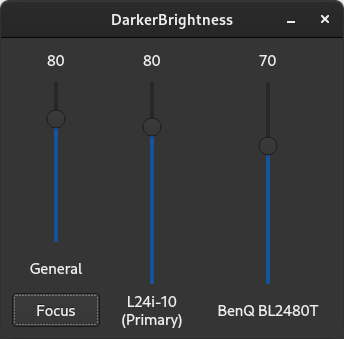

# DarkerBrightness
A simple Qt GUI that adjusts the display brightness for Linux desktop using ddcutil. 
 

Note: 
1. You may need to change the Qt version in CMakeLists.txt to the one you are using.
2. ddcutil requires sudo. You may need to adjust your system settings to avoid entering password. One method could be: 
`sudo visudo` in terminal, comment out `%wheel        ALL=(ALL)       ALL` and comment in `%wheel  ALL=(ALL)       NOPASSWD: ALL`.
3. Global shorcuts requires Qxt Library. You can install it using your package manager. For example on Fedora: 
`sudo dnf install libqxt-qt5-devel.x86_64`
