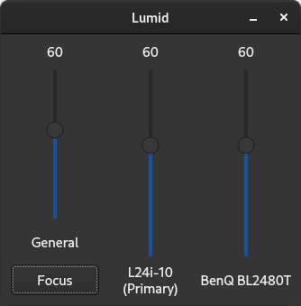

# Lumid
A simple Qt GUI that adjusts the display brightness for Linux desktop using ddcutil. 
## Screenshots
 

## Build
1. Install ddcutil: `dnf install ddcutil`
2. You may need to change the Qt version in CMakeLists.txt to the one you are using.
3. ddcutil requires sudo. You may need to adjust your system settings to avoid entering password. One method could be: 
`sudo visudo` in terminal, comment out `%wheel        ALL=(ALL)       ALL` and comment in `%wheel  ALL=(ALL)       NOPASSWD: ALL`.
4. Global shortcuts requires Qxt Libraries. You can install them using your package manager. For example on Fedora: 
`sudo dnf install libqxt-qt5-devel.x86_64`

## Use
This app has only been tested on my own Fedora 37 desktop. I wrote this because the other extensions/apps did not meet my personal requirement of simplicity and less lagging adjusting the brightness.
